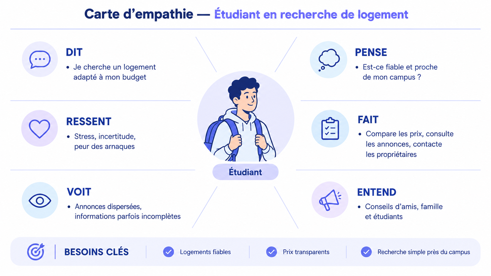
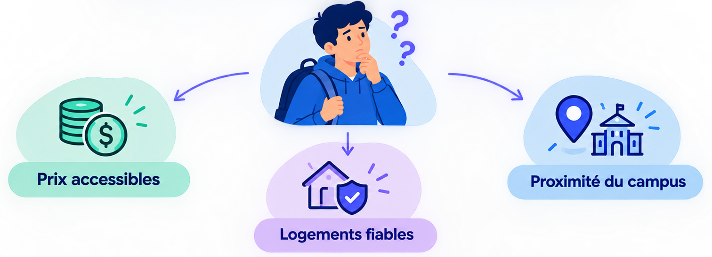

<!-- _class: blank -->
<!-- _paginate: false -->

# Plateforme de logement étudiants

---

<!-- _class: plan -->

# Plan

1. Introduction
2. Contexte du projet
3. Méthode de travail
4. Branche fonctionnelle
5. Branche technique
6. Conception
7. Réalisation
8. Conclusion

---

<!-- _class: blank -->
<!-- _paginate: false -->

# Introduction

---

# Introduction

contenu ici.

---

<!-- _class: blank -->
<!-- _paginate: false -->

# Contexte du projet

---

# Contexte du projet

contenu ici.

---

<!-- _class: blank -->
<!-- _paginate: false -->

# Méthode de travail

---

# Méthode de travail

contenu ici.

---

<!-- _class: blank -->
<!-- _paginate: false -->

# Branche fonctionnelle

---

<!-- _class: subsection -->

<!-- _paginate: false -->

# Carte d’empathie

---

---

<!-- _class: subsection -->

<!-- _paginate: false -->

# Definition de probleme

---

**Comment trouver un logement étudiant fiable, abordable et proche du campus au Maroc ?**

---

<!-- _class: subsection -->

<!-- _paginate: false -->

# ideation

---

---
<!-- _class: blank -->
<!-- _paginate: false -->
# Branche technique

---

# Branche technique

contenu ici.

---

<!-- _class: blank -->
<!-- _paginate: false -->

# Conception

---

# Conception

contenu ici.

---

<!-- _class: blank -->
<!-- _paginate: false -->

# Réalisation

---

# Réalisation

contenu ici.

---

<!-- _class: blank -->
<!-- _paginate: false -->

# Conclusion

---

# Conclusion

contenu ici.